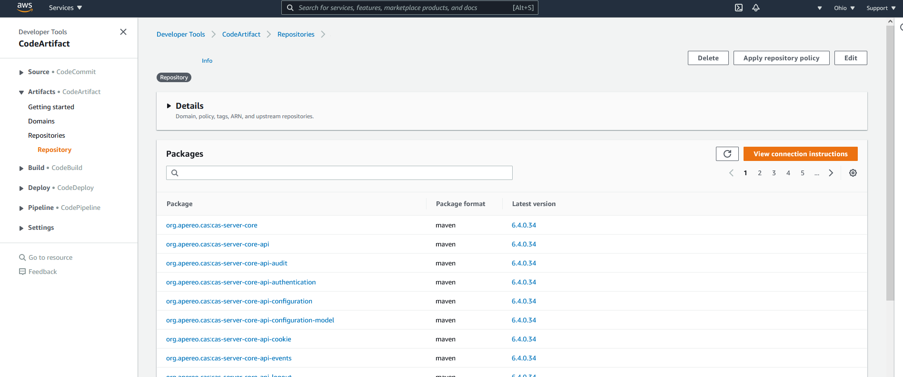
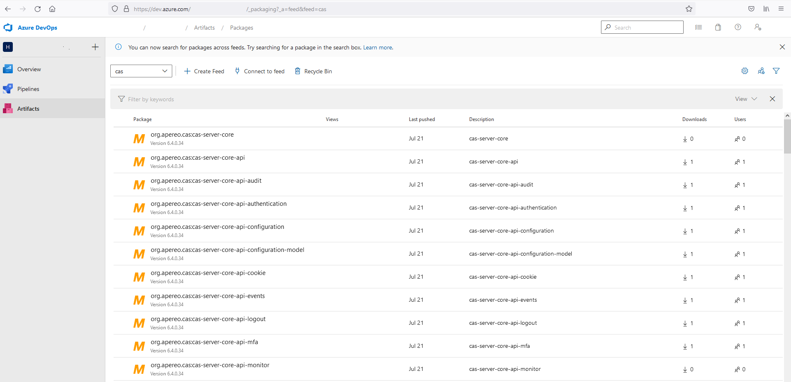
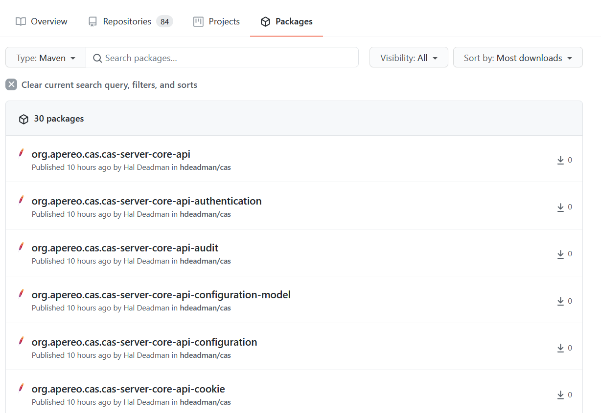

# Overview

If you contribute a fix or new feature to CAS you either need to use a snapshot build, 
wait for an official release or publish your own release to a private repository. 
In my situation I work somewhere that uses Gitlab for CI/CD and has a private repository that is not
accessible to Github CI/CD and I didn't want to figure out how to run a Github private runner 
since I am already using Gitlab private runners.  
By using Github Actions to build and publish CAS, but pushing the release to a cloud hosted private repository 
such as are available from AWS, Azure and Github, I am able to build a CAS release at any time from my fork
and my private overlay can be built in Gitlab using privately published artifacts from one of the cloud
hosted repositories. I prefer not having my CAS fork deviate from the main project (keeping any customizations 
in the overlay but usually contributing them back) so I added Github Actions workflows to CAS 6.4+
that make it easier to publish a tagged release from a fork to a private repository. 
One workflow is for publishing to a private AWS CodeArtifact repository, another is for publishing
to the GitHub Packages repository, and a third workflow can publish to an Azure Artifacts repository,
but the Azure Artifacts workflow is generic enough that it could be used to publish to a private
Nexus or Artifactory repository if it were accessible.

# How to Release

All three workflows only trigger on a four digit Git tag starting with a 6 or 7 (e.g. 6.4.0.1). The four digit version
differentiates the version from an official CAS release. These releases will be in your own
repository where they should not conflict with other resources in other repositories. When you initially
tag the release, all three workflows (GitHub, AWS, and Azure) will kick off, and the GitHub repository
publish should work since it requires no setup. If you don't want to publish to GitHub then you should cancel 
the workflow. Once the workflows have triggered, disable any of the workflows that won't be used or that you 
haven't configured the secrets for so they won't trigger on future tags.  Creating the tag to trigger the 
release is easy to do with the `Draft a new release` button on the Releases page for the CAS forked repository. 

# Cost Disclaimer

None of these private repositories are free although they may have a free tier. 
I have run my tests against GitHub as someone with a GitHub Pro subscription which comes with 2GB of Packages storage.
After that it claims to charge $0.25/GB/month and that storage may be shared with GitHub Actions artifacts
and logs. CAS publishes many modules so 2GB of storage may not hold many versions. 
GitHub Packages storage may be free for public repositories. You can purge all versions of your 
CAS packages with a script like this, which needs to live at root of CAS project:

```shell
#!/bin/bash
USERNAME_PAT=GitHub_username:personal_access_token
GROUP=org.apereo.cas
for TYPE in api core support webapp; do
cd $TYPE
  for PACKAGE in cas-server*; do
    curl --fail -X DELETE -u $USERNAME_PAT -H "Accept: application/vnd.GitHub.v3+json" https://api.GitHub.com/user/packages/maven/$GROUP.$PACKAGE
    RC=$?
    echo "Delete package $PACKAGE: $RC"
  done
cd ..
done
```
More targeted deleting could be done with a more involved script. 

# Publishing to GitHub Packages Repository

The GitHub Packages repository can be used with no setup because you already have a CAS fork in GitHub
and workflows in your fork can publish packages by default. Unfortunately the GitHub Package Repository
workflow gets errors like the following on random published files: 
```
> Failed to publish publication 'mavenJava' to repository 'CAS-Releases'
   > Could not PUT 'https://maven.pkg.GitHub.com/hdeadman/cas/org/apereo/cas/cas-server-core-api-mfa/6.4.0.28/cas-server-core-api-mfa-6.4.0.28.jar.md5'. Received status code 409 from server: Conflict
```
It also fails to publish the CAS shell jar, with a `400` error, possibly because it is too large, but it is not much larger than
the CAS Tomcat webapp war which publishes fine.
```
Execution failed for task ':support:cas-server-support-shell:publishMavenJavaPublicationToCAS-ReleasesRepository'.
> Failed to publish publication 'mavenJava' to repository 'CAS-Releases'
   > Could not PUT 'https://maven.pkg.GitHub.com/hdeadman/cas/org/apereo/cas/cas-server-support-shell/6.4.0.33/cas-server-support-shell-6.4.0.33.jar'. Received status code 400 from server: Bad Request
```
Since CAS publishes so many files, it is highly unlikely that a full release will be successfully published
until the issue with GitHub is resolved. I am assuming the issue is on the GitHub side because 
these errors don't show up when publishing to other repository types. CAS publishes over 400 modules
and each module includes resources, tests, sources, javadoc jars, the main artifact and a gradle module file, each 
of which has four hash files (md5, sha1, sha256 and sha512), so you are talking about enough files
getting published to have at least one `409 Conflict` error and that is enough to kill the build.

By skipping the CAS shell jar, which doesn't work due to `400 Bad Request` error, for GitHub Package Repository only, 
and reducing the number of artifacts published per module to only include the main artifact
(skipping source, resource, javadoc, and tests), publishes to GitHub Package Repository 
did succeed three times, followed by five failures, and then two more successes in three tries. For now,
it seems to fail slightly more than half the time which is not reliable enough to use.
I plan to open an issue with GitHub, so hopefully they can fix it, given a reliable way to recreate 
the problem. Publishing to GitHub often fails when publishing small files such as an md5 hash file.
One would think that they could compare the contents of the file they are adding with the file that already exists for 
some reason and not return a `409` if the file being `PUT` was identical to what was there.  

# Publishing to AWS CodeArtifact Repository

Publishing to an AWS Code Artifact repository has so far been very reliable (no failures). It requires 
more setup and configuration but is not difficult if you already have an AWS account and are familiar with 
setting up security policies. 

1. In the AWS Console under the CodeArtifact service, create "domain" and a "repository" under that domain.
1. Create an IAM user that can't login but that will own access tokens for publishing to CodeArtifact
1. Attach the `AWSCodeArtifactAdminAccess` policy to the user. (That is more privileges than should be necessary, 
   but I gave up finding a minimal policy that worked. I am comfortable with a dedicated user that can't login
   and whose Access Key will live as a relatively inaccessible GitHub Repository Secret. Depending on what else you 
   might use CodeArtifact for, reduced privileges may be in order.)
1. Create the following secrets in your fork of the CAS repository (under repository settings):

```properties
CODE_ARTIFACT_DOMAIN determined when the repository is created.
CODE_ARTIFACT_URL determined when the repository is created.
CODE_ARTIFACT_AWS_ACCESS_KEY_ID and CODE_ARTIFACT_AWS_SECRET_ACCESS_KEY should be created from IAM user with publish rights on repo
CODE_ARTIFACT_REGION is the region where the CodeArtifact repository exists
```

# Publishing to Azure Artifacts Repository

Azure Artifacts seems to be reliable and is easier to setup than AWS CodeArtifact. 
When you create an Azure Devops account you will get an organization and within that organization 
you can create a project. Inside the project, under settings, you can enable the `Artifacts` service.
Inside the Artifacts service you create a "feed" which just needs a name. The feed has some settings
related to visibility (organization or specific members) and scope (project or organization), and whether 
it should pull from dependencies from upstream sources. The feed can handle many types of dependencies, 
not just Maven. 

Once you have created the feed, click `Connect to Feed` and choose `Gradle` and it will show a build script
example on how to connect. Oddly it shows using a Maven settings.xml file to set the username/password
for the Gradle Maven repository, but you can ignore that since CAS has a workflow that works with 
Azure Artifacts and it doesn't use a settings.xml file. On the "connect" page, note the URL of 
the maven repository and the username. There will be a link for creating a personal access
token which will you will need to configure as a secret on your CAS fork in GitHub. 
The personal access token seems to require an expiration date, but it just needs to have the 
`Package (read & write)` permissions. 

The Azure Artifacts workflow requires the following secrets which you can create using the URL, username 
and personal access token for the password.

```properties
  ARTIFACTS_REPOSITORY_USER=Azure username
  ARTIFACTS_REPOSITORY_PWD=Azure personal access token
  ARTIFACTS_REPOSITORY_URL=Azure artifacts URL
```

The workflow that publishes to Azure Artifacts is fairly generic and could probably be used
for publishing to a private Nexus or Artifactory instance since it just needs a URL, username and password.
It's not as easy to setup as the GitHub Package Repository which requires no secrets
but it seems to be more reliable than GitHub Package Repository (at this time).

# Using Published Artifacts in a CAS Overlay 

When building your local CAS overlay project and using your personal tag from your private repository, 
there are a couple options. 
If you already use a private Nexus or Artifactory repository, the Azure Artifacts repository can 
be configured as a proxy repository using the username and personal access token you used to publish
for basic authentication credentials, but the personal access tokens aren't good forever, they last 1 year 
at most. The credentials for AWS CodeArtifact are only good for 12 hours so you are better off adding 
a repository to the overlay's list of repositories. That would look something like adding this to the buildscript
repositories and global repositories section of the overlay's build.gradle:

```groovy
        if (Boolean.valueOf(project.usePrivateRepo)) {
          maven {
            url project.privateRepoUrl
            credentials {
              username = project.privateRepoUsername
              password = System.env.PRIVATE_REPO_TOKEN
            }
          }
        }
```

Set the following properties in your ~/.gradle/gradle.properties using the URLs and username for your AWS CodeArtifact or Azure
Artifacts repositories:

```properties
usePrivateRepo=true
privateRepoUrl=https://xxx-000000000000.d.codeartifact.us-east-2.amazonaws.com/maven/yyy/
privateRepoUsername=aws
```

For the AWS CodeArtifact repository you will need to set the repository password in the environment with something like: 

```shell
export PRIVATE_REPO_TOKEN=$(aws codeartifact get-authorization-token --domain yourdomain --domain-owner 000000000000 --query authorizationToken --output text --region us-east-2)
```

The AWS CLI needs to be installed and configured with access keys for a user with sufficient rights to use the repository.
If the repository is not in the default region specified in your config, include the region on the command line, e.g. `--region us-east-2`. 
In the case of Azure Artifacts, the PRIVATE_REPO_TOKEN would be set to a personal access token. 

# Resources

* [AWS CodeArtifact](https://aws.amazon.com/codeartifact/)
* [Azure Artifacts](https://azure.microsoft.com/en-us/services/devops/artifacts/)
* [GitHub Packages](https://github.com/features/packages)


# Screen Shots

### AWS CodeArtifact



### Azure Artifacts



### Github Packages




[Hal Deadman](https://github.com/hdeadman)